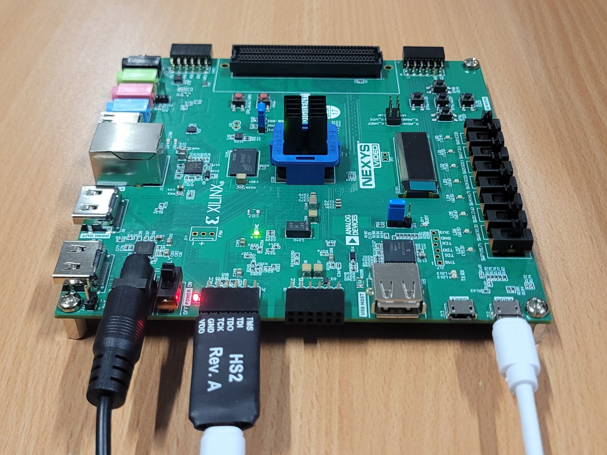

.. _tutorial_software:

=================
Software Tutorial
=================

Welcome to ADAM's Software Tutorial, where we'll guide you through the
process of compiling an example project, setting up the hardware,
and taking your design from compilation to execution.

Compiling an Application
========================

TODO

Setting Up the Hardware
=======================

Before you start, ensure you have the following hardware components ready:

- **Digilent Nexys Video**: FPGA board used in this tutorial.
- **JTAG-HS2 Programming Cable**: Serves as the debugger for
  programming and debugging.
- **Male Pin Headers (6 Pin)**: Used to connect the JTAG-HS2 to the Pmod port.

Refer to the picture bellow to correctly setup your hardware:

Loading the Bitstream
=====================

To program your FPGA with the Vivado GUI, follow these steps, carefully
avoiding connection to the JTAG-HS2 interface, which is intended for software
debugging later in the tutorial:

1. **Launch Vivado**: Start the Vivado GUI on your computer.

2. **Open Hardware Manager**: From the Vivado welcome screen or the main menu,
   directly open the "Open Hardware Manager."

3. **Auto-Connect**: Click on the "Auto Connect" in the Hardware Manager.
   Make sure that the JTAG-HS2 is not connected to your computer at this point
   to prevent the Hardware Manager from connecting to the wrong interface.
   The FPGA should be connected directly to your computer to utilize its
   onboard JTAG interface.

4. **Program Your Device**: In the Hardware Manager, right-click on your FPGA
   device listed under the "Hardware" tab and select "Program Device".
   Navigate to your compiled bitstream file and select it 
   to load onto the FPGA.

5. **Physical Reset**: After the bitstream has been loaded, it is crucial to
   press the physical reset button on your FPGA board.
   Failure to do so may result in the design not behaving as expected.

Starting OpenOCD
================

.. warning::

   Remember to terminate all Vivado processes before proceeding with OpenOCD.
   Sometimes, processes can remain running in the background even after closing
   the Vivado GUI, which can interfere with OpenOCD's ability to use the
   JTAG-HS2 probe. 

.. warning::
   
   If the JTAG-HS2 probe is connected after the container has started,
   you will need to restart the container to recognize the device properly.

OpenOCD is used as a bridge between the hardware debugger and GDB, 
enabling software debugging of the hardware.

1. **Connect JTAG-HS2**: Now, connect the JTAG-HS2 Programming Cable to your
   computer and to the FPGA using the Male Pin Headers.

2. **Launch OpenOCD**: Open a terminal and start 
   `OpenOCD <https://github.com/riscv/riscv-openocd>`_ with the appropriate
   configuration file.
   Make sure to run the command in the background with ``&``:

.. code-block:: bash

  (adam) ~ $ openocd -f openocd_hs2.cfg &

The expected output should resemble the following:

.. code-block:: bash

  Open On-Chip Debugger 0.12.0-dev-03126-ge95614e (2021-02-01-08:42)
  Licensed under GNU GPL v2
  For bug reports, read
      http://openocd.org/doc/doxygen/bugs.html
  Info : auto-selected first available session transport "jtag". To override use 'transport select <transport>'.
  Info : clock speed 1000 kHz
  Info : JTAG tap: riscv.cpu tap/device found: 0x249511c3 (mfg: 0x049 (Xilinx), part: 0x4951, ver: 0x2)
  Info : [riscv.cpu] Retry examination.
  Info : [riscv.cpu] Examination started.
  Info : [riscv.cpu] Examination failed: 8
  Info : [riscv.cpu] dtmcontrol=0x72c9b5f2
  Info : [riscv.cpu] XLEN=32, misa=0x40001124
  Info : [riscv.cpu] Target successfully examined.
  Info : starting gdb server for riscv.cpu on 3333
  Info : Listening on port 3333 for gdb connections
  Ready for Remote Connections
  Info : Listening on port 6666 for tcl connections
  Info : Listening on port 4444 for telnet connections

Starting GDB
============

With OpenOCD ready, proceed with debugging:

1. **Launch GDB**: Start GDB with your ELF file.

.. code-block:: bash

   (adam) ~ $ riscv32-unknown-elf-gdb path/to/your/application.elf

2. **Connect GDB to OpenOCD**: Inside GDB, connect to the OpenOCD server.

.. code-block:: bash

   (gdb) target remote :3333

Debugging with GDB
==================

The following steps represent a very basic example of what can be done during
a GDB debugging session.
This is just a starting point, and there are many other powerful features and
commands available in GDB for more complex debugging tasks.

1. **Load**: Load your application onto the FPGA.

.. code-block::

   (gdb) load

2. **Breakpoint**: Set a Breakpoint at ``main``

.. code-block::

   (gdb) break main

1. **Run**: Resume execution, and it will pause at the main function.

.. code-block::

   (gdb) continue

Ending the Debugging Session
============================

After debugging:

1. **Terminate GDB**: Close GDB with quit or Ctrl+D.

2. **Close OpenOCD**: Bring OpenOCD to the foreground with ``fg`` and then stop
   it with ``Ctrl+C``. You can also simply close ADAM's container.

Congratulations! You've navigated the process of programming, running, and
debugging an application on ADAM.

Troubleshooting
===============

If you're using the HS2 cable and encounter the following messages:

.. code-block:: text

   Info : auto-selecting first available session transport "jtag". To override use 'transport select <transport>'.
   Info : clock speed 1000 kHz
   Info : JTAG tap: riscv.cpu tap/device found: 0x249511c3 (mfg: 0x0e1 (Wintec Industries), part: 0x4951, ver: 0x2)
   Info : [riscv.cpu] Retry examination.
   Info : [riscv.cpu] Examination started.
   Info : [riscv.cpu] datacount=2 progbufsize=8
   Error: [riscv.cpu] Unable to halt. dmcontrol=0x80010001, dmstatus=0x00000c82
   Error: [riscv.cpu] Fatal: Hart 1 failed to halt during examine
   Error: [riscv.cpu] Examination failed. examine() -> -4
   Info : starting gdb server for riscv.cpu on 3333
   Info : Listening on port 3333 for gdb connections
   Error: Target not examined yet

Then simply **press the reset button on ADAM**, and try again.

Also, if you see the following error:

.. code-block:: text

   Error: libusb_claim_interface() failed with LIBUSB_ERROR_BUSY
   Error: unable to open ftdi device with description 'Digilent USB Device', serial '*' at bus location '*'

Then:

- **Close Vivado Hardware Manager**, and
- **Ensure no Vivado processes are still running in the background**.
